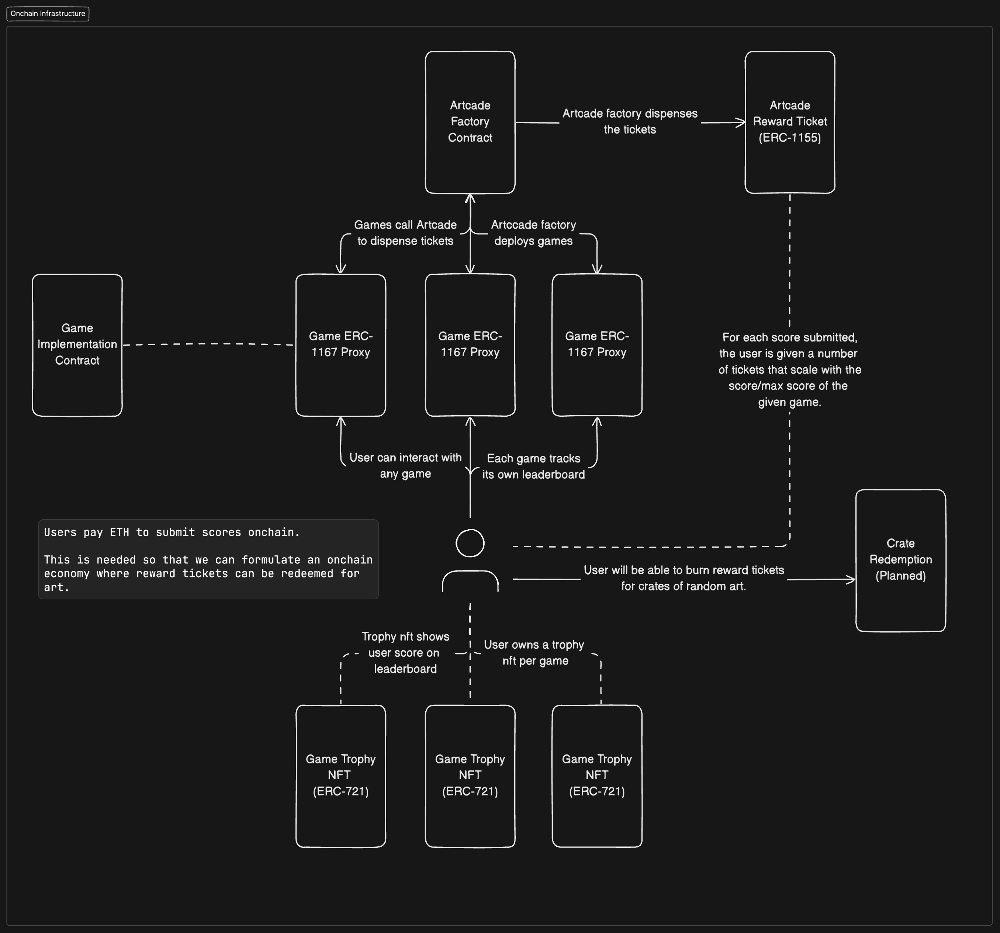

# 0xArtcade Smart Contracts

*All the smart contracts powering 0xArtcade*

## Getting Started
1. Install foundry
2. Install poetry
3. Install solidity dependencies with `make install`
4. Install python dependencies with `poetry install`
5. Run `make build` to build the contracts
6. Run `make tests` to run all tests
7. Run `make cov-tests` to run coverage tests

## High Level Architecture

## Disclaimer
While best efforts have gone into developing, testing, and peer reviewing these contracts, unexpected behavior may be present in the contracts under certain conditions.

This codebase is provided on an "as is" and "as available" basis.

We do not give any warranties and will not be liable for any loss incurred through any use of this codebase.

## License
This code is copyright Marco Peyfuss, 2024 and is licensed under the MIT license.
