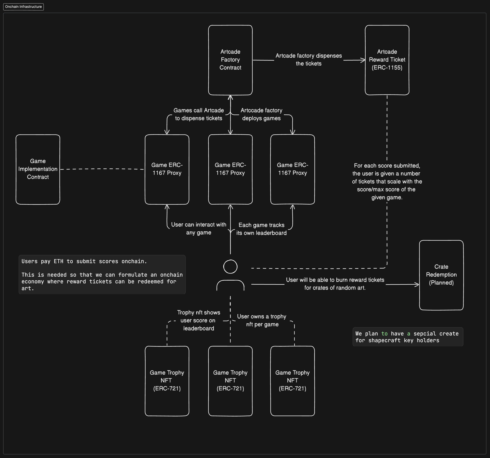

# 0xArtcade Smart Contracts

*All the smart contracts powering 0xArtcade*

## Getting Started
1. Install foundry
2. Install poetry
3. Install solidity dependencies with `make install`
4. Install python dependencies with `poetry install`
5. Run `make build` to build the contracts
6. Run `make tests` to run all tests

## High Level Architecture
